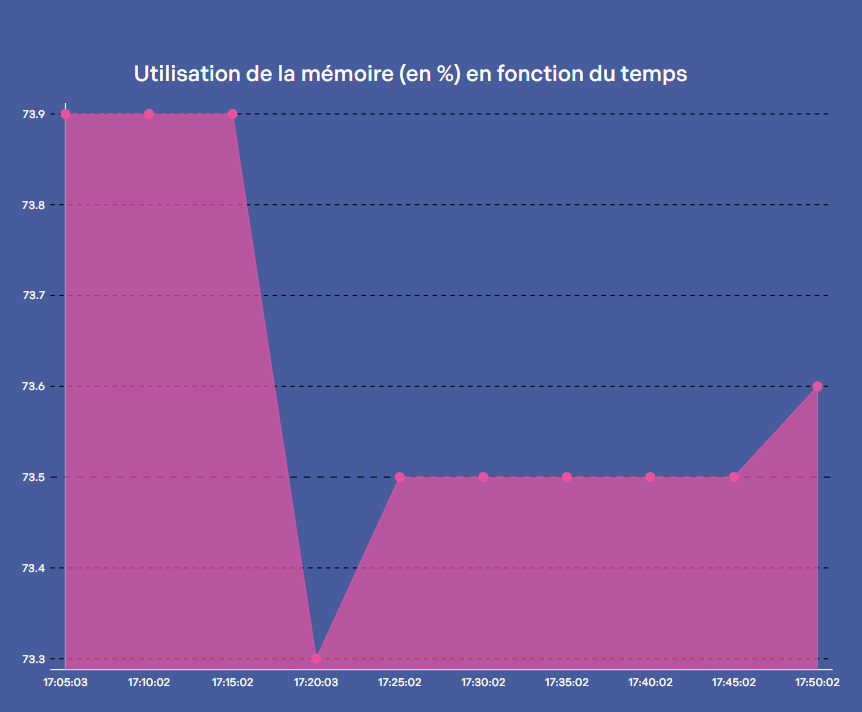

# IT Infrastructure Monitoring Platform

Once installed, this platform will enable system administrators to quickly retrieve detailed status reports of all servers within the infrastructure and the latest alerts from C.E.R.T. (http://www.cert.ssi.gouv.fr/). The software will also provide email notifications in case of critical situations. Examples of critical situations include when a server has been unresponsive for more than 30 minutes, when a hard disk reaches 100% capacity, or when RAM usage hits 100%, among others.

## Features

- Server Monitoring: Retrieve detailed status information about all servers in the IT infrastructure.
- Alerts Integration: Fetch and display the latest alerts from C.E.R.T.
- Email Notifications: Send email alerts in case of critical incidents (e.g., server unresponsiveness, disk space, RAM usage).
- Customizable Alerts: Define custom rules for triggering alerts based on specific conditions.
- Automated Reporting: Generate periodic reports summarizing the health and performance of the IT infrastructure.
- Website: Access data and information about this platform through our dedicated website.

## Usage

To use this monitoring platform, follow these steps:

1. Installation:
   Clone the repository to your server.
   Ensure that Python and BASH are installed.
2. Configuration:
   Configure the monitoring settings.
3. Execution:
   Run the main monitoring script (collecte.sh) using BASH.

## Screenshot

## Dependencies

The project relies on the following technologies:

Python 3.x
BASH scripting
Standard Ubuntu server binaries and libraries
Additional Python libraries beyond the standard ones may be used based on project guidelines.

## Contributing

Feel free to contribute to this project by suggesting improvements. Contributions are welcomed and encouraged!
